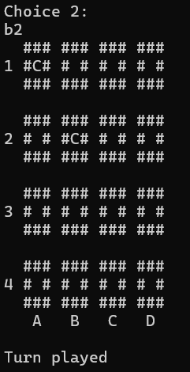

# Rust Memory

## Installation

The game is written in [Rust](https://www.rust-lang.org). If you do not have a rust toolchain on your system 
yet, [install](https://www.rust-lang.org/tools/install) it, rustup is the preferred way to change that. When the toolchain is ready, go in your the file, build and run the
game with

    cargo run --release
    

## How to play

The rules are very simple, you select a 2 tiles and you have to do pairs, if you get all the pairs, this is the end.  
You give the coordinates in the console pannel and the board will show you the card with thooses coordonates, if they are the same, they stay showed but if they are different, they disappear.  
